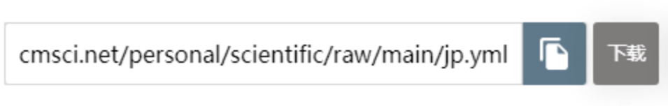
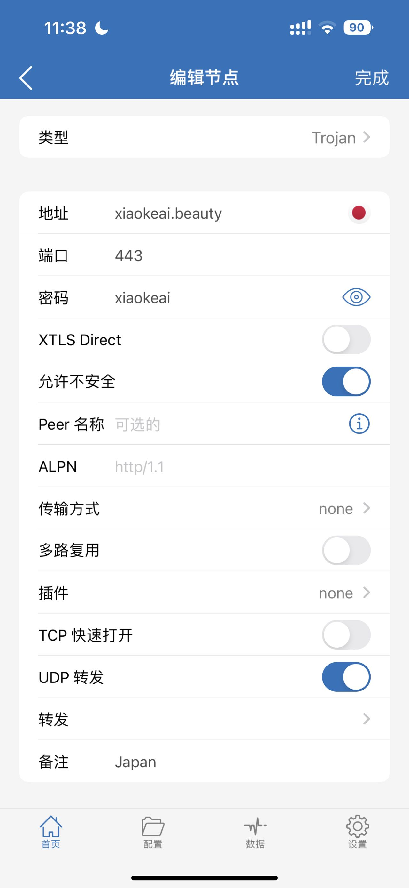
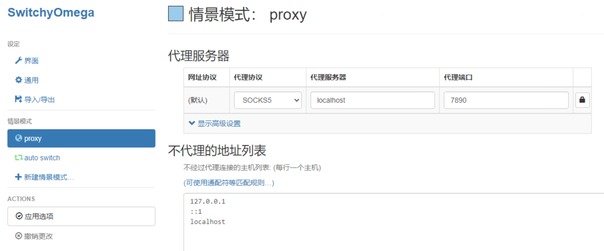

# Scientific
## 配置信息
- 服务器地址：xiaokeai.beauty
- 端口号：443
- 协议：Trojan
- 密码：xiaokeai

## 有效期
2023年09月27日之前可用，之后需要换域名，我将在此页面更新信息，需要请和我联系。

## 配置加载流程 
### ClashX的配置URL
  * 境外：https://raw.githubusercontent.com/ResearcherInCS/Scientific/main/jp.yml
  * 国内：http://cmsci.net/personal/scientific/raw/main/jp.yml
  
  

### 直接导入配置文件使用
或直接导入压缩包里的jp.yml即可。

### 配置二维码
需要扫的二维码如下，即QR.jpg：

## 各平台配置教程

WINDOWS/MACOS/LINUX/IOS/IPADOS/ANDROID/浏览器等平台的配置方式请查看此库`使用教程`的各个文件夹的pdf文件来配置，如有问题可以咨询我。

## 注意事项
- 如配置完无法连接，建议勾选“允许不安全”“不进行https检查”等选项。

- 推荐电脑端使用ClashX配合ProxyOmega使用，手机端IOS推荐shadowrocket（不支持spectra），shadowrocket需要收费5新币，如果我们关系好可以联系我要apple id免费给你下载，安卓推荐trojan。

- Clash for windows 国内下载地址：https://www.yanlutong.com/pcsoft/8886/

不保证可以一直用，但聪明的大家肯定可以通过其他渠道获得此软件的。